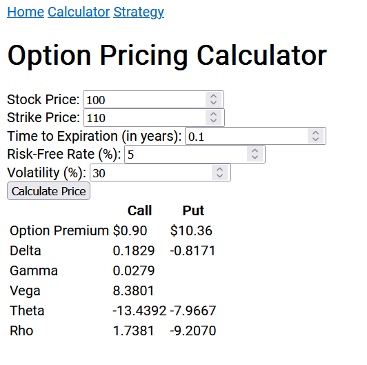

# Options Project

A brief description of what this project does and who it's for.

## Black-Scholes Option Pricing Calculator

This was the first part of the project I completed. It is a simple calculator to calculate the fair prices of options, according to the Black-Scholes equation.

The Black-Scholes equation has five variables: 
- The price of the underlying asset **S**
- The strike price of the option **K**
- The risk-free rate of return **r**
- The time until expiration **t**
- Volatility **σ** 

### Assumptions of the Black-Scholes Model

The assumptions we use to derive the Black–Scholes–Merton differential equation are as follows:

1. The rate of return on the riskless asset is constant and thus called the risk-free interest rate.
2. Random walk: The stock price follows a geometric Brownian motion, and it is assumed that the drift and volatility of the motion are constant.
3. There are no dividends during the life of the derivative.
4. There are no riskless arbitrage opportunities.
5. There are no transaction costs or taxes (frictionless market).
6. Ability to borrow and lend any amount, even fractional, of cash at the riskless rate.
7. Ability to buy and sell any amount, even fractional, of the stock (this includes short selling).

## Option Strategy Creator

This section of the project allows users to create options trading strategies in a sandbox mode before seeing a graphical output of the strategy.

